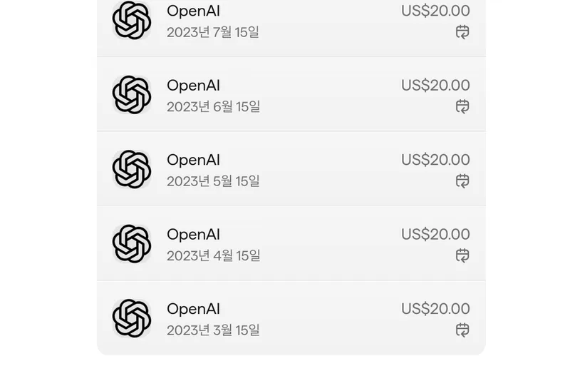

얼리어답터 기질 덕에 ChatGPT-4 출시 직후부터 유료 구독을 시작했다. 그 후 Claude, Cursor, Gemini까지 여러 AI 서비스를 거쳐, 현재는 Gemini와 Claude를 구독하고 있다. 처음 LLM을 접했을 때만 해도 '업그레이드된 심심이' 정도로 생각했지만, 간단한 알고리즘은 물론 실제 동작하는 코드를 짜내는 것을 보고 큰 충격을 받았다.

한동안 정체되는가 싶던 AI 모델 경쟁은 DeepSeek 같은 후발주자의 등장을 기점으로 다시 불붙었다. 덕분에 사용자 입장에서는 더 나은 모델이 나올 때마다 갈아타는 '구독 유목민'으로 지내기 편해졌다. AI 서비스는 오래 쓴 고객을 붙잡는 혜택보다 기술력으로 경쟁하는 시장이라, 결국 더 좋은 모델을 내놓는 쪽이 사용자를 가져간다.

물론 모델이 발표될 때마다 나오는 벤치마크 점수는 크게 신뢰하지 않는다. 특정 벤치마크에 과하게 최적화된 경우가 많아, 실사용 환경에서의 체감 성능과는 차이가 있기 때문이다. 내가 직접 여러 모델을 써보며 내린 잠정적인 결론은 다음과 같다.

- **범용성 (ChatGPT):** 다양한 기능과 뛰어난 음성 대화 기능 덕분에 일상적인 용도로는 여전히 가장 쓰기 편하다.
- **코딩 (Claude):** 코딩 능력 자체는 Claude가 가장 뛰어나다고 느낀다. 특히 복잡한 코드베이스를 이해하고 수정하는 능력이 인상적이다. 한때 Cursor IDE를 주력으로 사용했지만, 최근 요금제 개편과 사용량 측정의 투명성 문제로 신뢰를 잃어 현재는 추천하지 않는다.
- **개인적인 주력 (Gemini):** 지금 제일 많이 쓴다. 컨텍스트 창이 100만 토큰으로 넉넉하고, 구독에 구글 드라이브 2TB가 딸려 오고, NotebookLM으로 공부하기도 편하다. Gemini 2.5 Pro 성능도 이 정도면 충분하다.

처음 이런 도구들을 쓸 때는 '개발자라는 직업이 대체될 수 있겠다'는 위기감이 들었다. 지금은 생각이 바뀌었다. 일은 확실히 빨라졌지만, AI가 짠 코드를 읽고 시스템에 붙이고 문제가 생기면 책임지는 건 여전히 내 몫이다. 의사가 AI로 정보를 찾아도 진단에 대한 책임은 의사가 지는 것과 비슷하다.

"AI가 있으니 보안 담당자는 필요 없다"며 팀을 해체했다가 곤란을 겪었다는 일본 회사 이야기처럼, 한동안은 이런 시행착오가 이어질 것 같다. 그래도 길게 보면 코드를 직접 치는 시간은 줄고, 도메인을 이해하고 구조를 잡고 AI가 내놓은 결과를 검토하는 시간이 늘어날 거라고 본다.

그래서 지금은 두려움보다 기대가 훨씬 크다. 다음엔 또 어떤 도구가 나와서 일하는 방식을 바꿔놓을지 즐겁게 기다리고 있다.
