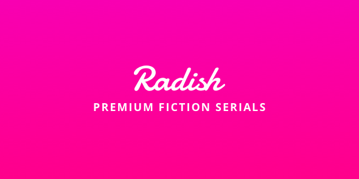

## 2021년 처음 만난 레디쉬

2021년에 프리랜서로 일할 때 프론트엔드 엔지니어로 제안을 받았을 때에는 사실 큰 기대를 하지 않았다. 북미 서비스라 직접 이용해보지 못했고, 검색을 통해 알아보았을 때에는 카카오 엔터테인먼트에 인수되었던 것을 알게 됐다. 그냥 어디든지 제안이 오면 그 사실에 감사하고, 코딩테스트나 면접 기회를 가질 수 있어서 가벼운 마음으로 임했다.

1차 기술 면접을 합격하고 2차 면접으로 제드, 수와 만났을 때 나는 레디쉬에 입사하고 싶어졌다. 긴 시간은 아니였지만, 1시간의 대화 만으로도 제드는 좋은 사람인 것을 알게 됐고, 더불어 일하는 분들도 좋으리라 짐작했다. 다행히 레디쉬에서도 나를 좋게 봐줘서 합격을 하고 2022년 1월 3일부로 출근하기로 확정지었다.

채용이 확정되어 쉬는 동안에는 신나게 디아블로2:레저렉션을 하며 휴식을 취했다.

## 2022년 레디쉬 프론트엔드 엔지니어로 일하며

레디쉬에서는 다른 곳에는 없는 복지가 있는데, 1년에 2번씩(상,하반기) 제주도 워케이션 비용 지원을 해줬다. 나는 일한지 1년이 되지 않아서 1번만 가능했는데, 하반기에 가기에는 출산을 앞둔 와이프와 함께하기는 힘들 것 같아 4월경에 가족과 함께 제주로 가서 워케이션을 즐겼다. 제주도 워케이션은 2023년에 레디쉬가 타파스와 합병하면서 더이상 제공되지 않았고, 레디쉬 구성원들이 모두 아쉬워 했던 정말 꿀같은 복지였다.

레디쉬에서 일하면서 나는 정말 즐거웠다. 레디쉬픽션 프로덕트를 사랑하는 구성원들이 모여서, 자유롭게 본인들이 맡은 일들을 책임감 있게 해 나가는 회사. 어디가서 다시 경험하기 힘들거라 생각한다. 출퇴근 시간도, 재택도 모두 자율이었다. 적어도 내가 근무하는 기간에는 말이다. 누구도 터치하지 않고, 누구도 악용하지 않았다. 재택이나 업무중에 개인적인 사유가 생겨서 잠시 자리를 비워야 할 경우에는 슬랙 서울 채널에 공유를 하고, 돌아와서 모자란 시간은 자율적으로 채웠다.

누군가 감시하지 않아도, 마이크로 매니징을 하지 않아도 스스로 일을 찾아서 해 나가는 경험은 정말 환상적이었다. 지라 티켓을 통해서 내가 하는 업무가 투명하게 공유되고, 회사의 상황들도 주간 회의와 개발 회의를 통해서 투명하게 공유되었다.

나도, 다른 분들도 모두 서로를 믿어가며 일하는 유토피아 같은 회사였다. 그래서 레디쉬에서 일하면서 나는 불평불만을 한 번도 한 적이 없다. 그 투덜이 스머프 같은 내가.

레디쉬 웹을 유지보수하며 크고 작은 프로젝트에 참여하고 눈 깜짝할 사이 1년이 흘렀다. 개발자로 일하며 가장 즐거웠던 1년이었다.

## 2023년, 아디오스 레디쉬

영원할 것 같았던 레디쉬는 그러지 못했다. 카카오 엔터테인먼트에 인수될 때만 해도 이제 망할 일은 없겠다 싶었지만, 타파스와 합병되고 혼란의 시기를 겪고, 서울 사무실은 닫기로 결정됐다. 카카오 엔터테인먼트에서 진행한 과정들이 참 나이스하지 못하고 다시는 겪기 싫은 경험이었다.

갑작스런 멤버들과의 헤어짐으로 마음이 정말 정말 시큰했다. 레디쉬와 멤버들, 프로덕트를 이렇게 짧은 기간에 사랑하게 된 것은 레디쉬가 정말 좋은 회사였기 때문 아닐까? 레디쉬에서는 비록 여기까지지만 언젠가 이 멤버들과 다시 일할 날이 있었으면 좋겠다.

_**그 때까지 모두 행복한 일만, 좋은 일만 가득했으면 좋겠다.**_
